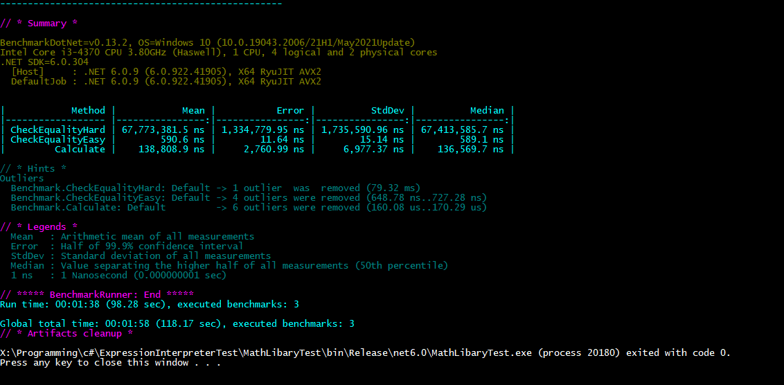

# Expression Interpreter Benchmarks
This was a small learning project on how to implement Math Expression Parsing and how to work with it.
Additionally we had to analyze the runtime for different operations like calculating the result of a function of x and the comparism between different Expression Trees.
(Note: The tests are distributed over the different branches)

## Test 1 (Branches Master & Test 3)
The first test was just crudely implementing an Expression Tree and checking the equivalence between two trees by just calculating both functions for some random x values and checking if they yield the same result. 
 
As you can see we have a quite good time for a single calculation. But to ensure the equivalence we have to use more values. It seems to be running in O(logn) with n being the number of equality tests.

## Test 2 (Branch Test 2)
In the second test we tried to implement some simplification Algorithm, to simplify a given Expression Tree in order to check the equality more easily. But we quickly abandoned this approach as we found a good library to do this for me (see test 3).

## Test 3 (Branch Test 4)
In the third test we experimented with the library [AngouriMath](https://github.com/asc-community/AngouriMath). It has methods to parse, evaluate and simplify Mathematical Expression in a wide range. It also can handle Differentiation, Integration, Limits, Complex Numbers and much more.
Here are the Benchmarks we did: 
 
The CheckEqualityHard Test checked the equality of two very hard (and long) polynomials - One in the factorized form and the other in the standard form. 
The CheckEqualityEasy Test did the same thing, but with a much easier polynomial pair. 
Lastly the Calculate Test just tested the runtime to evaluate the same polynomial like in Test 1 with one Value.

# Results
The results were pretty clear to favour the Library implementation as it has a way better runtime in checking the equality.
Nevertheless we learned a lot about implementing Expression Trees, how to Tokenize and Parse them and much more!
